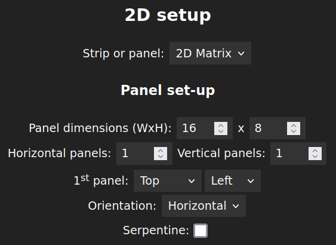

# ChanLEDier

A [WLED][]-powered chandelier. Customizable in [OpenSCAD][].

[openscad]: https://openscad.org/
[wled]: https://kno.wled.ge/

## Requirements

- 6 or 8 WLED-compatible LED strips.
- WLED board supporting 6 or 8 GPIO pins (i.e. ESP32).
- Sufficient power supply and any other WLED requirements.
- 3D-printed parts from one of the `models` subfolders.

## Configuration

WLED v0.14 introduces a `2D` configuration menu:

I configured the LED strips as a single 2D matrix, which gives you some options
for tweaking the appearance of 1D effects:

## Ideas

- Custom effects?
- Nicer 3D models? (PRs welcome!)
