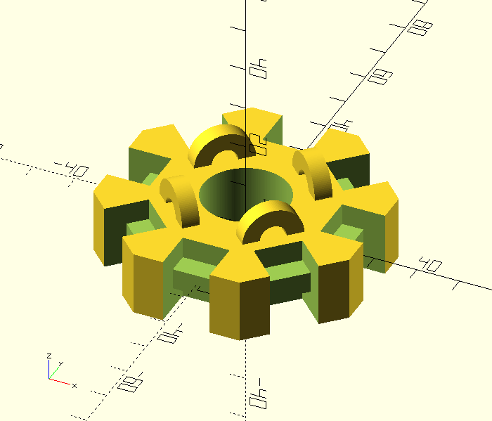
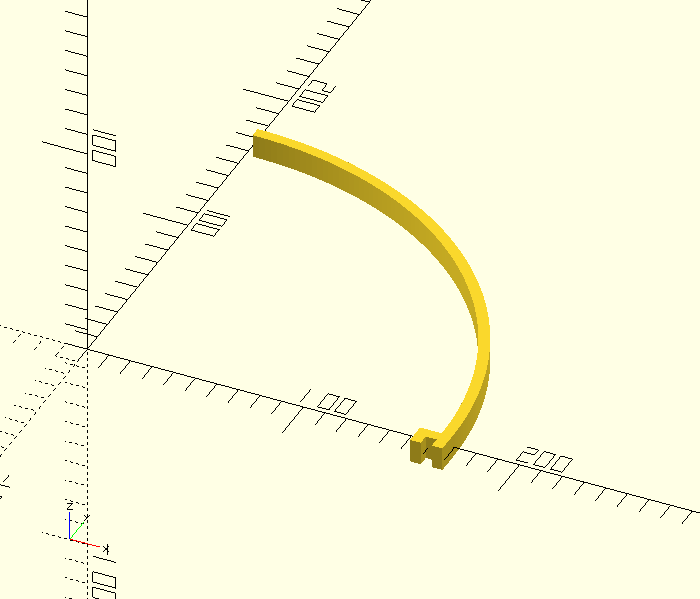
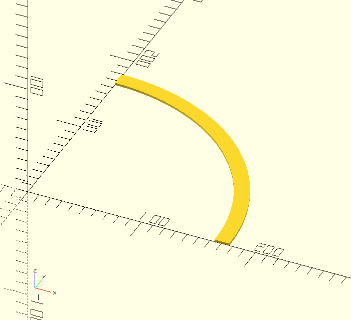
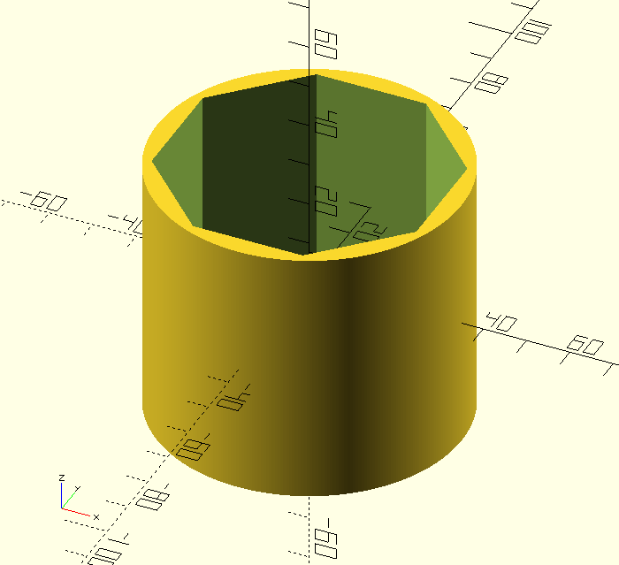
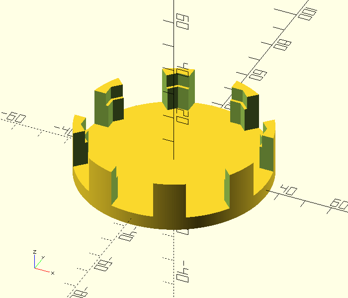
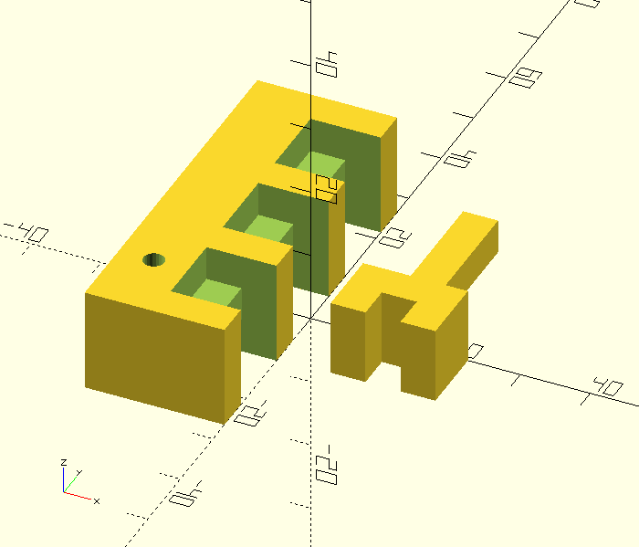

# Hemisphere

A simple half-spherical design.

See `config.scad` for parameters.

## Hub

## Arm

## Rail

The rails can be glued to the sides of the arms, so that a diffusing material
can be attached above the LED strip.

## Shroud

The shroud can be placed on top of the hub, to hide the wiring, and to hold the
arms in place.

## Shield

The shield can be placed on the bottom of the hub, to hide the wiring.

## Connector Test

For finding the correct `connector_margin`.

